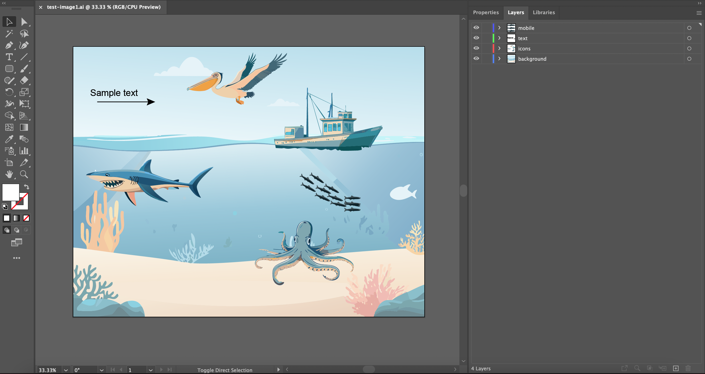
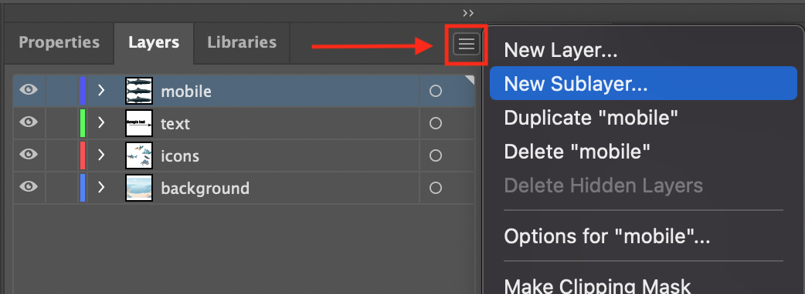
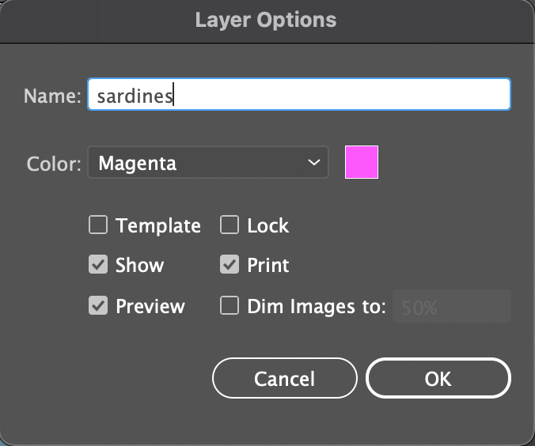
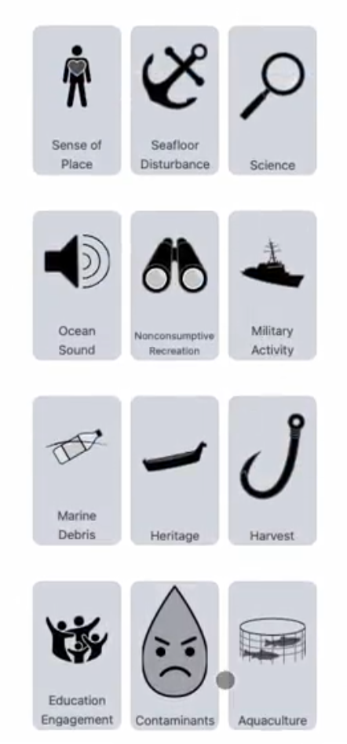
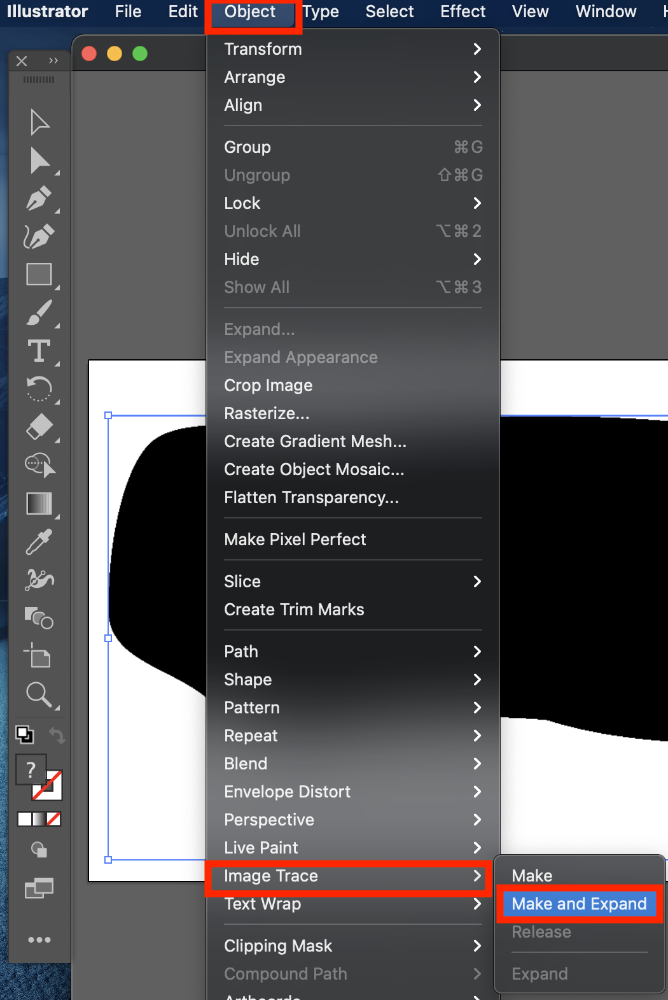
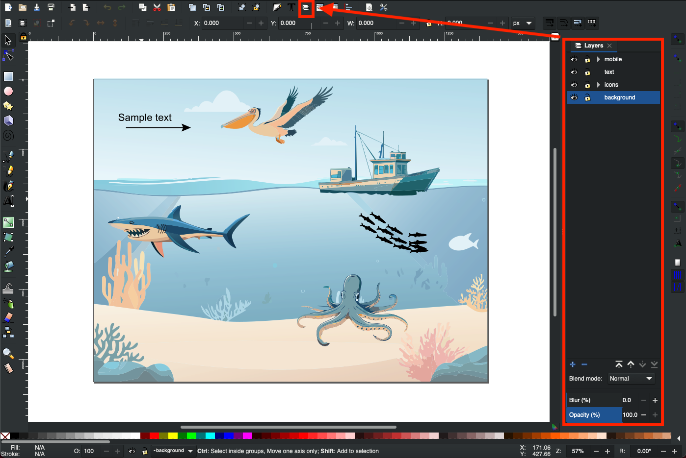
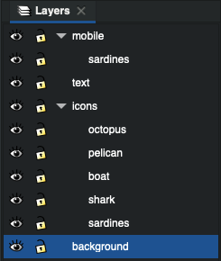
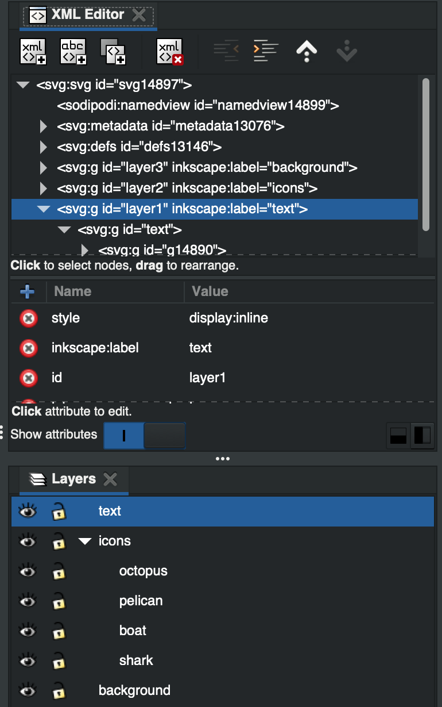
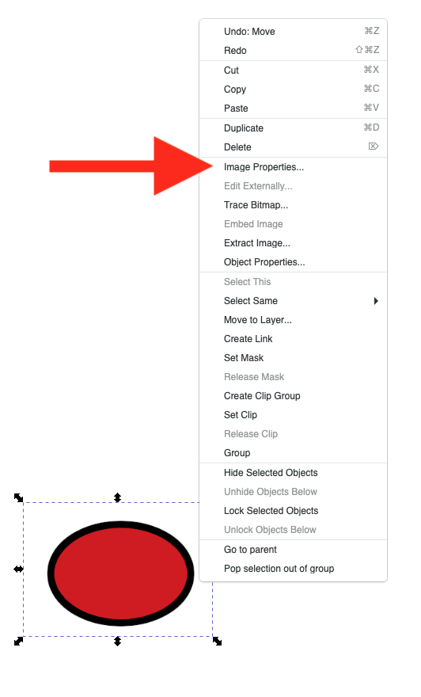

# Chapter 3 Creating an Infographiq image #

Infographiq works with vector-based images that are set up in a very specific way. Here we provide instructions for two vector graphics packages: [Adobe Illustrator](https://www.adobe.com/products/illustrator.html) (requires a paid subscription) and [Inkscape](https://inkscape.org/) (free).

You’ll also need the example folder for Infographiq, which provides a full working example that you can fiddle around with. We’ll be referring to this folder extensively in this guide and you can download a compressed version [here](https://marinebon.org/infographiqJS/infographiq_example.zip). Just unzip the folder after it has been downloaded.

You can see the working example in action as a finished product [here](https://marinebon.org/infographiqJS/infographiq_example/infographic.html).

## 3.1 Adobe Illustrator ##

This guide assumes you have a basic knowledge of using Illustrator ([here is a great series of tutorials](https://www.adobe.com/learn/illustrator)). In particular, you’ll need to understand how "layers" work in Illustrator ([and here’s a tutorial for that](https://helpx.adobe.com/illustrator/using/layers.html)).

**NOTE: The methods of implementation vary slightly for desktop view vs mobile view when using "layers". For the sake of continuity, this documentation will consider both as part of a singular workflow for optimizing a .svg graphic for use with Inforgraphiq in both dekstop and mobile settings.**

In the Infographiq example folder, you’ll find a file called **"test_image1.ai"**. Open this file in Illustrator and you’ll see the following:

If you check out the "Layers" tab for the image above, you’ll see that the image is composed of four layers:

If you don't see "Layers", use this access path: *Top Navigation Bar > Windows > Layers

 - When optimizing a graphic for desktop view only, the required layer order for Infographiq is listed below. You'll notice it's missing the "mobile" section as shown in the image. All the following steps will still apply, just skip the sections about "mobile" in the following sections. 
    1. text
    2. icons
    3. background

 - When optimizing a graphic for desktop and mobile, the required layer order of an Infographiq image is shown in the image below.
    1. mobile
    2. text
    3. icons
    4. background

### 3.1.1 Layer organization

1. **mobile**: 
     This layer is optional. However, when viewing the same webpage on your desktop (or laptop) computer compared to a mobile device, you may have noticed that the area and orentation of the screen shifts from landscape (like your TV) to portrait (like your mobile device). This shift causes the elements and items on web pages to be displayed very differently. When creating a vector for Infographiq, it is good practice to account change of display because society ubiquitously uses both device types when surfing the waves of information on the world wide web. 
     
     We will put a pin in this section for the time being and revisit at the end of this section because we will need to use some layers from "3. icons" to complete it correctly.

2. **text**: 
    
    This layer is optional and, if present, must be called lower case “text”. It contains additional explanatory text and graphics for the image that the Infographiq Javascript can toggle on and off. To see this in action, click the “Text in image” button in the upper right of our [Infographiq example](https://marinebon.org/infographiqJS/infographiq_example/infographic.html).

    In the Layers panel, after we click ">" to expand the "text" layer, we can see that this layer contains several elements denoted by <Group>:

    

    There are three essential things here:

    A. All of the elements are vector-based (nothing raster-based, raster means image such as .tif, .jpg, or .png). If you happen to have raster-based elements in your image (or are not sure), we strongly reccomend that you find a vector version or attempt to convert the raster item to a vector using the [image trace tool](https://helpx.adobe.com/illustrator/using/image-trace.html). Rasters will break the functionality of Infographiq and are not meant to be used in these workflows. 

    B. None of the elements within this layer can be named “text”. The following (where one of the elements is named text) is not allowed:

    

    C. Double check that the font you select for the text elements displays well in a browser. The default font for Illustrator is often “Myriad Pro”, which does not display well. There are many great alternatives, with one being “Arial”.

3. **icons**: 

    **This layer is required** and contains all of the clickable elements in the image. This layer can be named anything, except for “text” or the name of any other clickable element in the image. We reccomend the name "icons" though.

    If you check out the "Layers" panel for “icons”, you’ll see that it contains four sublayers; octopus, bird, boat, & shark.

     

    Each of these sublayers defines a single clickable component of the image.

     - The names of these sublayers should not contain spaces, commas, or be called “text”.

     - All elements within the sublayers should be vector-based and not raster-based. If you happen to have raster-based elements in your image (or are not sure), we can tell you what to do about it in this section of this document: dealing with raster-based elements.

     - Nothing should overlap on top of anything you want to be clickable.

     - Each sublayer contains all of the elements for a single clickable icon.

     - The elements in the sublayer, if named, should not have the same name as the sublayer itself. So, for example, the following won’t work :
     

4. **background**:

    This is an optional layer that contains all non-responsive elements of the image. This layer can be called anything (other than “text” or the name of a clickable sublayer). It is ignored by the Infographiq Javascript. We reccomend calling it "background" though.

5. **mobile** continued: 
    
    Step 1: Expand the layers for "icons" using the ">" toggle next to the word. Then, select the four sublayers; octopus, bird, boat, & shark under by clicking on the top option "octopus", then while holding the "shift" key, click on the bottom option "shark". You should see all four sublayers highlighted in light blue. You can realease the shift key. 
    
    Step 2: In the top right corner of the "Layers" window, click on the three stacked bars to expand the options menu and select "Duplicate Selection".
    

    Step 3: Next, with the four orginal sublayers still selected, hover the mouse on top of them then click and hold them, then "drag and drop" them directly over the "mobile" layer. You will see that they will be moved to the "mobile" layer section.
      

    **Considerations:**
    - Icons might need to be adjusted to fit into the example format shown in the exmaple image below. If your icons are too wide or long, you will need to adjust them to make them fit properly. Or, use a different icon to represent the same subject. 
     

### 3.1.2 Dealing with raster-based elements

How do I tell if something is raster or vector-based?

One dead give-away that an image is raster-based is if the file is saved in a raster-based file format. You can determine the file format of a file by checking out the last few characters of the file name (the file extension). Some common raster-based file formats are (with their extensions):

    .gif (Graphic Interchange Format)

    .jpg or .jpeg (Joint Photographic Experts Group)

    .png (Portable Network Graphics)

    .psd (Photoshop Document)

    .tiff (Tag Image File Format)

Checking the file extension isn’t a fool-proof system though. Just because an image is saved in some other format than those above doesn’t mean that it isn’t a raster-based image. So, how can you know for sure? Well, open the image up in Illustrator and take a close look at the Layer panel. If the image is raster-based, it will say <Image> under the appropriate layer (be sure to click the arrow just to the left of the layer name to see what it contains). See below for an example:
 

**Converting a raster to a vector**

If you have some raster-based elements that you’d like to include in your Infographiq image, Illustrator has got you covered. You’ll just need to convert those elements into vectors and here’s how to do that:

1. Select image (from Layers; or Select All from menu).

2. From the menu, select Object > Image Trace > Make and Expand.

3. Delete (trash icon in Layers menu) or Unite/Merge (in Pathfinder menu) the selected layers until you achieve the desired simplified icon result.

### 3.1.3 Saving the image

To be used by Infographiq, the file must be exported in svg format. To do so:

1. From the menu, click: File > Export > Export As.
2. In the following screen, select svg format. Be sure to click “Use Artboards”.
3. In the final screen that pops up, be sure to set Object IDs to “Layer Names”, as follows:

4. The default for Illustrator is to add an “01” to your svg file name (so, “example.svg” becomes “example01.svg”. Change the file name back to your desired choice.

## 3.2 Inkscape

This guide assumes you have a basic knowledge of using Inkscape ([here is a great series of tutorials](https://inkscape.org/learn/tutorials/)). In particular, you’ll need to understand how layers work in Inkscape ([and here’s a tutorial for that](https://inkscape.org/~JurgenG/%E2%98%85layers-objects-and-paths)).

In the Infographiq example folder, you’ll find a file called test-image1.svg. Open this file in Inkscape and you’ll see the following:

If you check out the Layers panel for the image, you’ll see the following:

This is the required layer order of an Inkscape image.
### 3.2.1 Layer organization

1. text: This first layer is optional and, if present, must be called lower case “text”. This layer contains additional explanatory text and graphics for the image that the Infographiq Javascript can toggle on and off. To see this in action, click the “Text in image” button in the upper right of our Infographiq example. The essential thing here is that all of the elements are vector-based (nothing raster-based). If you happen to have raster-based elements in your image (or are not sure), we can tell you what to do about it in this section of this document: dealing with raster-based elements.

2. icons. The second layer is required and contains all of the clickable elements in the image. This layer can be named anything, except for “text” or the name of any clickable element in the image. If you check out the Layers panel for “icons” (see image just above), you’ll see that it contains six sublayers (chartexample1 through 6). Each of these sublayers defines a single clickable component of the image.

    - The names of these sublayers should not contain spaces, commas, or be called “text”.

    - All elements within the sublayers should be vector-based and not raster-based. If you happen to have raster-based elements in your image (or are not sure), we can tell you what to do about it in this section of this document: dealing with raster-based elements.

    - Nothing should overlap on top of anything you want to be clickable.

    - Each sublayer contains all of the elements for a single clickable icon.

3. background: an optional layer that contains all non-responsive elements of the image. This layer can be called anything (other than “text” or the name of a clickable layer). It is ignored by the Infographiq Javascript.

### 3.2.2 Editing the layer XML

In order for the Infographiq image to behave properly, you will need to edit the XML for the image. In order to do so, you’ll need to have two panels visible:

1. Layers (to show from Menu, Layer > Layers…)

2. XML Editor (to show from Menu, Edit > XML Editor…)

Let’s zoom in on these panels for the image inkscape_example.svg:

For each of your layers:

1. Click the associated entry in the XML Editor (hint: the “inkscape:label” will match the layer name).
2. In the box to the right, change the id to match the layer name.
3. Select the “text” layer in the XML Editor. In the box to the right, click the red X by “display: inline” (thereby deleting that row). Note: in the example file inkscape_example.svg, the “display: inline” line has already been deleted.

### 3.2.3 Dealing with raster-based elements

How do I tell if something is raster or vector-based?

One dead give-away that an image is raster-based is if the file is saved in a raster-based file format. You can determine the file format of a file by checking out the last few characters of the file name (the file extension). Some common raster-based file formats are (with their extensions):

    - .gif (Graphic Interchange Format)

    - .jpg or .jpeg (Joint Photographic Experts Group)

    - .png (Portable Network Graphics)

    - .psd (Photoshop Document)

    - .tiff (Tag Image File Format)

Checking the file extension isn’t a fool-proof system though. Just because an image is saved in some other format than those above doesn’t mean that it isn’t a raster-based image. So, how can you know for sure? Well, open the image up in Inkscape and right click on it. If in the options you see “Image Properties…”, you’ve got a raster-based image on your hands (see image below).

Converting a raster to a vector

If you have some raster-based elements that you’d like to include in your Infographiq image, Inkscape has got you covered. You’ll just need to convert those elements into vectors and [here’s a tutorial on how to do that](https://inkscape.org/doc/tutorials/tracing/tutorial-tracing.html).

### 3.2.4 Saving the image

To be used by Infographiq, the file must be exported in svg format. Good news! Inkscape’s native file format is already svg. When you save the image, just be sure to save it in the format “Inkscape SVG (#.svg)”.
